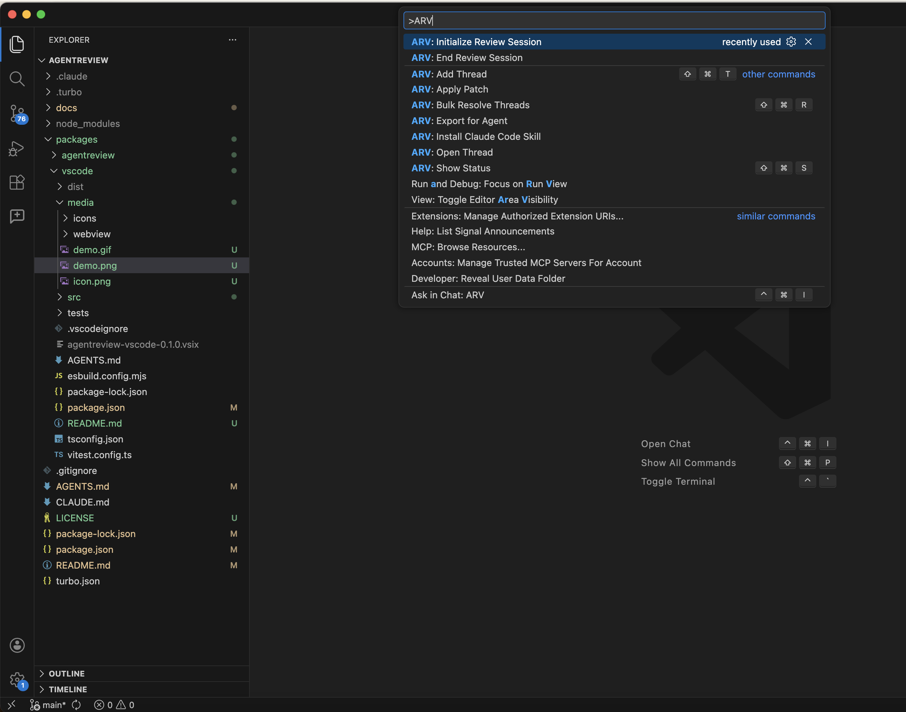
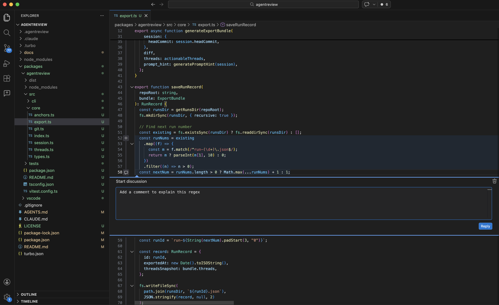
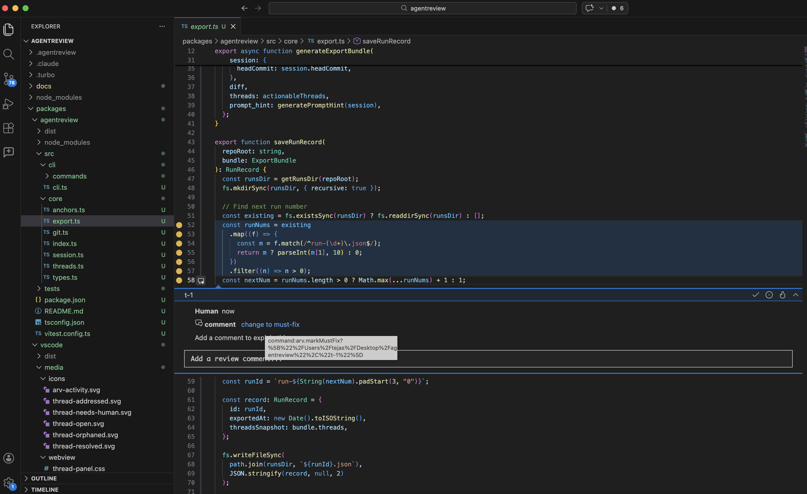
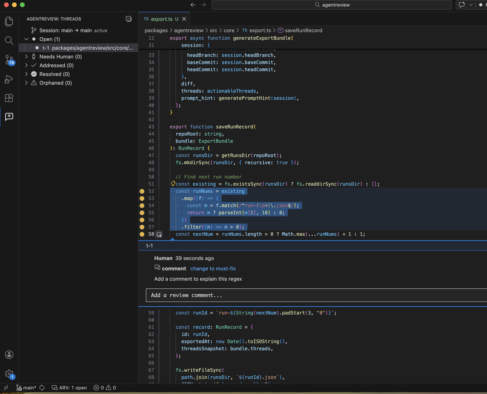
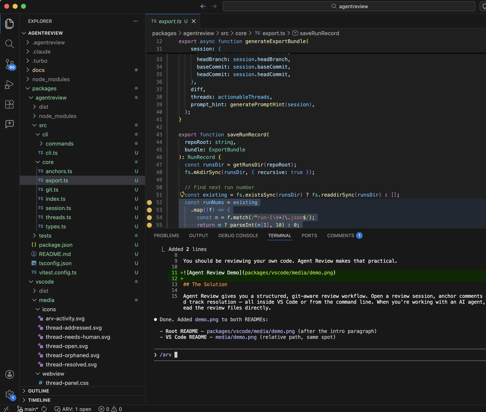

# AgentReview for VS Code

Code review for AI-generated changes. Anchor review threads to specific lines, track resolution, and let agents fix issues automatically.

**Initialize a review session** from the command palette (`Cmd+Shift+P`).

**Select code and add review comments** — threads anchor to the exact lines you selected.

**Escalate issues to must-fix** by clicking the severity badge in the comment.

**Track all open threads** in the Activity Bar panel, grouped by status.

**Let Claude fix everything** — type `/arv` in Claude Code and it addresses each thread automatically.

## Quick Start

1. Open a repo in VS Code
2. Run **ARV: Initialize Review Session** from the command palette (`Cmd+Shift+P`)
3. Select code, right-click → **ARV: Add Thread** (or `Cmd+Shift+T`)
4. Type your review comment — it anchors to the selected lines

## Adding Threads

Select code in the editor, then:

- **Right-click** → **ARV: Add Thread**
- **Keyboard:** `Cmd+Shift+T` (Mac) / `Ctrl+Shift+T`
- **Command palette:** ARV: Add Thread

Threads appear as inline comments in the editor, just like PR review comments. Each thread is anchored to the exact code region you selected.

You can also create a thread by typing a comment on any uncommented line — this creates a `comment`-severity thread automatically.

## Thread Severity

Threads have two severity levels:

- **comment** (default) — observations, suggestions, questions
- **must-fix** — blocking issues that must be addressed

Toggle severity using the icons in the thread header:
- Click the flame icon to escalate to **must-fix**
- Click the comment icon to downgrade to **comment**

## Thread Lifecycle

Each thread has a status:

| Status | Meaning |
|--------|---------|
| **open** | Awaiting action |
| **needs-human** | Agent flagged for human review |
| **addressed** | Anchor text changed after a patch was applied |
| **resolved** | Marked done |
| **orphaned** | Anchor lost after code changed significantly |

Use the inline icons on each thread to **resolve**, **reopen**, or **reply**.

## Activity Bar

The **Agent Review** panel in the activity bar shows all threads grouped by status. Click any thread to jump to its location in the editor.

Each status group shows a count. Resolvable groups have a **Resolve All** button to bulk-resolve threads in that category.

## Status Bar

The status bar shows a live summary: `ARV: X open, Y addressed, Z resolved`. Click it to focus the thread panel. Hover for a full breakdown.

## Bulk Actions

Run **ARV: Bulk Resolve Threads** (`Cmd+Shift+R`) to resolve threads in bulk. Options:

- All open threads
- All addressed threads
- All threads in the current file
- All unresolved threads

## Working with Agents

### Agents with file access (Claude Code, Cursor, etc.)

Agents can read `.agentreview/session.json` and `.agentreview/threads.json` directly from the repo root — no export needed.

### Sandboxed agents

Run **ARV: Export for Agent** to generate a JSON bundle containing the session, threads, and diff. Feed this to your agent.

### Applying patches

After an agent produces changes, run **ARV: Apply Patch**. Threads automatically re-anchor to their new locations and update status:

- Threads whose anchor text changed → **addressed**
- Threads whose anchor can't be found → **orphaned**

## Claude Code Integration

If you have [Claude Code](https://docs.anthropic.com/en/docs/claude-code) installed, the extension automatically installs the `/arv` skill on activation. In Claude Code, type `/arv` and the agent will:

1. Read all review threads
2. Fix `must-fix` issues first, then `comment` threads
3. Reply to each thread explaining what was changed
4. Print a summary table

You can also install the skill manually from the command palette: **ARV: Install Claude Code Skill**.

## Gutter Decorations

Anchored lines show gutter icons colored by status. Hover over a decorated line to see the thread ID, severity, status, and first message, with a link to open the full thread.

## Multi-Repo Support

Open a folder containing multiple git repos — the extension auto-discovers all `.agentreview/` sessions and manages them independently. The status bar and tree view aggregate across repos.

## Commands

| Command | Shortcut | Description |
|---------|----------|-------------|
| ARV: Initialize Review Session | | Start a review on the current branch |
| ARV: Add Thread | `Cmd+Shift+T` | Add a review thread on selected code |
| ARV: Show Status | `Cmd+Shift+S` | Show session summary and thread counts |
| ARV: Export for Agent | | Export review data as JSON |
| ARV: Apply Patch | | Apply a diff and re-anchor threads |
| ARV: Bulk Resolve Threads | `Cmd+Shift+R` | Resolve multiple threads at once |
| ARV: End Review Session | | Close the current session |
| ARV: Install Claude Code Skill | | Install the `/arv` skill for Claude Code |

## How It Works

All state lives in `.agentreview/` at the repo root (auto-added to `.gitignore`). The extension watches these files and refreshes the UI automatically when they change — whether edited from the CLI, an agent, or another tool.

Anchor relocation uses exact text matching first, then fuzzy matching (longest common subsequence, 60% similarity threshold).

## License

MIT
